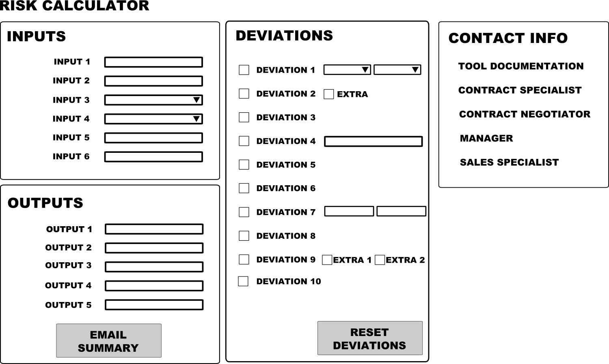
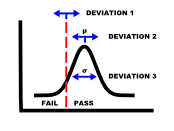

# web-tool-riskcalculator

 
 
<h2>Background</h2>

At my previous company, I was the subject matter expert for a specific sales contract exhibit involving a performance guarantee. This guarantee was technical in nature and based off of an international IEC standard. As a result, negotiations of this exhibit with customers was often complicated and typically involved some deviations from both the IEC standard and from our company's internal guidelines. These deviations often added to an already difficult-to-quantify risk of failing the performance guarantee, with associated liquidated damages in the millions of dollars.

Due to the risk involved, the approval process for any contract deviations was managed by a team of performance specialists. As the number of contracts (and requested deviations) increased globally, this approval process increasingly became a bottle-neck in terms of turn-around time and put pressure on the contract signing schedule. A team of local subject matter experts, local sales contractor negotiators, and the performance specialists worked together to develop a process that codified typical deviations and their associated risk impacts in order to streamline the approval process. 

I worked closely with the chief performance specialist to turn these risk calculation methodologies into a web-based tool, the Risk Calculator. This tool was eventually used by teams around the globe and (i) allowed local contract negotiation teams to better assess deviations to the performance guarantee, (ii) improve communications with the performance specialists during the deviation approval process, and (iii) decrease turn-around time of the approval process by off-loading the risk calculations from the performance specialists. 

Unfortunately, no source code of the final web-based Risk Calculator is included due to IP concerns. However, this documentation is meant to highlight the thought-process behind the problem (contract deviations) and the solution (a risk calculator)... 
<ul>
<li>Performance Guarantee - what was being negotiated</li>
<li>Deviations and Risk - why a process and tool was needed
<li>Risk Calculator - how it works
</ul>

<h2>Performance Guarantee</h2>

The performance guarantee stated that a product under test would meet or exceed a specified threshold within a margin of uncertainty. An IEC standard was used to test the product, which specified everything from test equipment to performance calculations to methods of estimating test uncertainty. Additionally, the company had internal guidelines above and beyond the IEC standard to specify certain aspects of the test.

Depending on real world constraints, customers would often request deviations from either the IEC standard or the company guidelines. The default contract exhibit had a standard level of risk associated with passing or failing the performance guarantee, based on historical performance test results. Failing a test could potentially involve a substantial amount of money in the form of liquidated damages, therefore estimating the risk of failure was an important part of the contract approval process. 

<h2>Deviations and Risk</h2>

When a contract was being negotiated, any requested deviations to the baseline performance guarantee had to be approved by a team of performance specialists. This typically involved estimating the impact of each individual deviation, and estimating an overall risk of failure accounting for all of the requested deviations.  

I worked closely with the team of performance specialists to identify a list of deviations that were commonly requested during contract negotiations. For each of these deviations, we developed the rules by which they impacted the overall risk estimate. I was then responsible for implementing these rules and additional inputs and calculations into a web-based tool, the Risk Calculator.

<h2>Risk Calculator</h2>

The Risk Calculator consisted of four main components: Inputs, Deviations, Outputs and Contact Info. 

The <b>Inputs</b> section allowed the user to describe certain characteristics of the contract under review, some of which were merely used for documentation purposes while others changed some of the starting variables in the risk calculation. 

The <b>Deviations</b> section contained a numbered list of possible deviations from the standard contract that could be selected. It was up to the contract negotiator to identify the deviations from the contract language and select the corresponding items in the Risk Calculator. Some deviations also required additional user inputs once selected. 

The <b>Outputs</b> section showed the final results and some intermediate values, specifically the overall risk of failing the performance guarantee and an estimate of the potential liquidated damages.

The <b>Contact Info</b> section provided names and emails of the performance specalists, contract negotiators and tool developer, along with links to documentation on the Risk Calculator and the performane guarantee negotiation process.

<h3>How It Works</h3>

The purpose of the Risk Calculator was to estimate the overall risk of failing a performance guarantee. The primary assumption behind the risk calculations was that the expected performance of the product could be modelled as a normal distribution. And based on empirical data from previous performance tests, normal distributions (mean and standard deviation) for each product were built into the Risk Calculator. The risk of failure of a performance test was then determined by whether or not the expected performance of the product was above or below the threshold of the guarantee.

To calculate this risk, a Monte Carlo simulation of 100,000 samples is generated by random sampling of the normal distribution to get a set of expected performance values. All of the expected performance values were then compared to the specified threshold for the performance guarantee, and the percentage of samples that failed the threshold was calculated as the total risk of failure.

Each deviation that was selected did one or more of the following: adjusted the mean and/or the standard deviation of the expected performance normal distribution, adjusted the threshold of the pass/fail guarantee, or had no impact (but noted for documentation purposes). The adjustments of such deviations are shown in the figure below.

The Monte Carlo simulation was done in the client browser using vanilla Javascript, and was ran each time the user changed any input or deviation. For each change, a new set of 100,000 samples was created and a new risk estimate was calculated.
 

 

 And last, an <bold>Email Summary</bold> button was included which automatically generated a pre-built email with a summary of all of the inputs, selected deviations, and outputs. This email was directed at the performance specialists who would be reviewing the results and providing approval in the contract negotiation process, which allowed a reproducible and easily communicated set of results to facilitate the contracting process.
 

 
